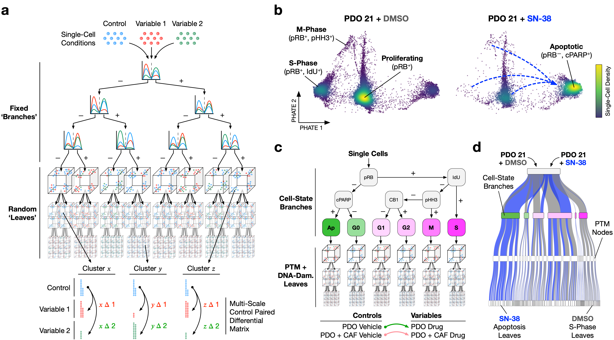

Implementation of Trellis
=========================

This library runs code associated with the Trellis paper which is on `BioRxiv <https://www.biorxiv.org/content/10.1101/2022.10.19.512668v1>`_. Code to reproduce the
figures in the paper can be found on the `TapeLab's github repo
<https://github.com/TAPE-Lab/Ramos-et-al-Trellis>`_. Note that an earlier version of `MultiscaleEMD <https://github.com/atong01/MultiscaleEMD/>`_ was used to run these experiments. Installing this version can be accomplished by downloading the source at `this commit <https://github.com/atong01/MultiscaleEMD/tree/35f91c1aa4a209638d5884ea32afba64fe6a4960>`_ and installing with :code:`pip install -e .` from the :code:`MultiscaleEMD` directory.

In brief, Trellis is a method to compare single-cell dataset distributions
under different treatment conditions while normalizing for multiple controls.
Paired Trellis implements a Kantorovich-Rubenstein distance with tree ground
distance allowing for a normalization step against a specified control per
treatment. 

Installation
------------

Trellis is available in `pypi`. Install by running the following:

.. code-block:: bash

    pip install MultiscaleEMD

This code was tested with python 3.7-3.10. Issues can be filed directly on the `MultiscaleEMD <https://github.com/atong01/MultiscaleEMD/>`_ project.

Data
----
All mass cytometry files are available on `Cytobank <https://community.cytobank.org/cytobank/projects/1461>`_.

Compiled TOBis mass cytometry PDO-CAF dataframe is available on `Mendely <https://data.mendeley.com/datasets/hc8gxwks3p>`_.

References
----------

BioRXiv Link: https://www.biorxiv.org/content/10.1101/2022.10.19.512668v1::

    @article {Ramos Zapatero2022.10.19.512668,
        author = {Ramos Zapatero, Maria and Tong, Alexander and Sufi, Jahangir and Vlckova, Petra and Cardoso Rodriguez, Ferran and Nattress, Callum and Qin, Xiao and Hochhauser, Daniel and Krishnaswamy, Smita and Tape, Christopher J},
        title = {Cancer-Associated Fibroblasts Regulate Patient-Derived Organoid Drug Responses},
        elocation-id = {2022.10.19.512668},
        year = {2022},
        doi = {10.1101/2022.10.19.512668},
        publisher = {Cold Spring Harbor Laboratory},
        URL = {https://www.biorxiv.org/content/early/2022/10/21/2022.10.19.512668},
        eprint = {https://www.biorxiv.org/content/early/2022/10/21/2022.10.19.512668.full.pdf},
        journal = {bioRxiv}
    }
